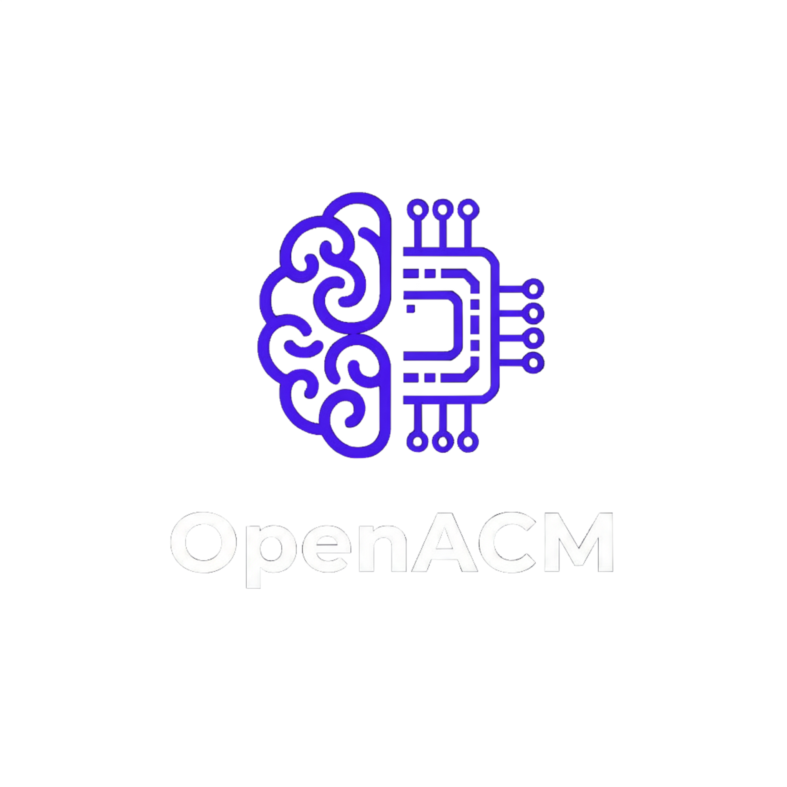

<p align="center">
  
</p>

# OpenACM — Open Autonomous Agent

<p align="center">
  
  
  
  
  
  
</p>

**OpenACM** is a self-hosted autonomous AI agent that runs on your PC. It controls your local environment, writes and executes code, navigates the web, and connects to any MCP server — all through a modern web dashboard.

No subscriptions. No cloud dependency. Your data stays local.

> Created and maintained by [Jeison Hernandez](https://github.com/Json55Hdz) / JsonProductions.  
> If you use or build on OpenACM, a credit or a star goes a long way.

---

## What it can do

- **Run commands & code** — executes shell commands and stateful Python (Jupyter kernel)
- **Browse the web** — Playwright-powered browser automation: login, scrape, screenshot
- **MCP Server support** — connect to any [Model Context Protocol](https://modelcontextprotocol.io) server (unity-mcp, filesystem, custom tools, etc.)
- **Multi-channel** — chat via Web, Telegram, or Console, all sharing the same AI brain
- **Skills system** — define reusable Markdown-based skills the AI triggers automatically
- **Sub-agents** — spawn specialized agents that work in parallel on tasks
- **RAG memory** — ChromaDB long-term memory that persists across conversations
- **Local intent router** — hybrid local/cloud architecture that skips the LLM for simple commands (~5ms, no tokens spent)
- **Loop trace debugger** — inspect every iteration: context size, tool calls, LLM timing, truncations

---

## Quick Start

### Prerequisites

- Python 3.12+
- Node.js 20+
- An API key from any supported LLM provider

### Windows

```powershell
git clone https://github.com/Json55Hdz/OpenACM.git
cd OpenACM
.\setup.bat       # first time: installs everything and launches OpenACM
```

Next time just run:
```powershell
.\run.bat
```

### Linux / macOS

```bash
git clone https://github.com/Json55Hdz/OpenACM.git
cd OpenACM
chmod +x setup.sh run.sh
./setup.sh        # first time: installs everything and launches OpenACM
```

Next time just run:
```bash
./run.sh
```

### Docker

```bash
docker-compose up -d --build
docker logs openacm   # your dashboard token is printed here
```

Open `http://localhost:47821`, paste the token, done.

---

## First Launch

1. The console prints your **Dashboard Token** — copy it
2. Open `http://localhost:47821`
3. Paste the token to log in
4. Go to **Configuration** and add your LLM API key

---

## Supported LLM Providers

Uses [LiteLLM](https://github.com/BerriAI/litellm) internally — any provider it supports works:

| Provider | Example model |
|---|---|
| OpenAI | `gpt-4o`, `gpt-4o-mini` |
| Anthropic | `claude-opus-4-5`, `claude-sonnet-4-5` |
| Google Gemini | `gemini/gemini-2.0-flash` |
| Groq | `groq/llama-3.3-70b-versatile` |
| Ollama (local) | `ollama/llama3.2` |
| Any OpenAI-compatible API | configure custom base URL in settings |

---

## MCP Servers

Connect to any MCP server from the **MCP Servers** dashboard page:

| Mode | When to use |
|---|---|
| Remote HTTP (modern) | unity-mcp, most modern servers — just paste the URL |
| Remote SSE (legacy) | older SSE-based MCP servers |
| Local stdio | run a local process (`npx @modelcontextprotocol/server-filesystem`, etc.) |

Once connected, the AI automatically sees and uses those tools.

---

## Dashboard

| Page | What it does |
|---|---|
| Dashboard | Real-time stats, activity, live events |
| Chat | Multi-channel conversations with tool call visibility |
| Tools | Browse available tools and execution history |
| Skills | Create and manage Markdown-based AI skills |
| Agents | Manage sub-agents |
| MCP Servers | Connect to external tool servers |
| Traces | Per-request debugger: context size, tool timings, errors |
| Configuration | LLM model, API keys, channels, preferences |

---

## Project Structure

```
OpenACM/
├── frontend/                   # React + Next.js dashboard
│   ├── app/                    # Page routes
│   ├── components/             # UI components
│   ├── hooks/                  # API and WebSocket hooks
│   └── stores/                 # Zustand state
├── src/openacm/
│   ├── core/
│   │   ├── brain.py            # Agentic loop + trace system
│   │   ├── llm_router.py       # LiteLLM interface + retries
│   │   ├── local_router.py     # Local intent classifier
│   │   ├── memory.py           # Conversation memory
│   │   └── rag.py              # Vector memory (ChromaDB)
│   ├── tools/
│   │   ├── mcp_client.py       # MCP server manager
│   │   ├── registry.py         # Tool registry
│   │   └── ...                 # Built-in tools
│   └── web/
│       └── server.py           # FastAPI server + WebSocket
├── skills/                     # Built-in skill definitions
├── config/                     # Local config (not committed)
├── setup.bat / setup.sh
└── run.bat / run.sh
```

---

## Privacy

OpenACM is fully self-hosted. The only outbound traffic is what you explicitly trigger:

- LLM API calls to the provider you configured
- Telegram/Discord messages if you connect those channels
- Browser requests when you ask it to visit a site

Everything else — conversations, API keys, files, memory — lives in `data/` and `config/` on your machine. Use Ollama for a fully offline setup.

---

## System Requirements

| | Minimum | Recommended |
|---|---|---|
| OS | Windows 10 / Ubuntu 20.04 / macOS 12 | Windows 11 / Ubuntu 22.04 |
| RAM | 8 GB | 16 GB |
| Storage | 5 GB | 10 GB |
| Python | 3.12+ | 3.12+ |
| Node.js | 20+ | 20+ |

---

## Contributing

Contributions are welcome. See [CONTRIBUTING.md](CONTRIBUTING.md).

---

## License

[MIT](LICENSE) — free to use, modify, and distribute.  
Copyright (c) 2026 Jeison David Hernandez Pena (JsonProductions). All copies and derivatives must include the original copyright notice.
