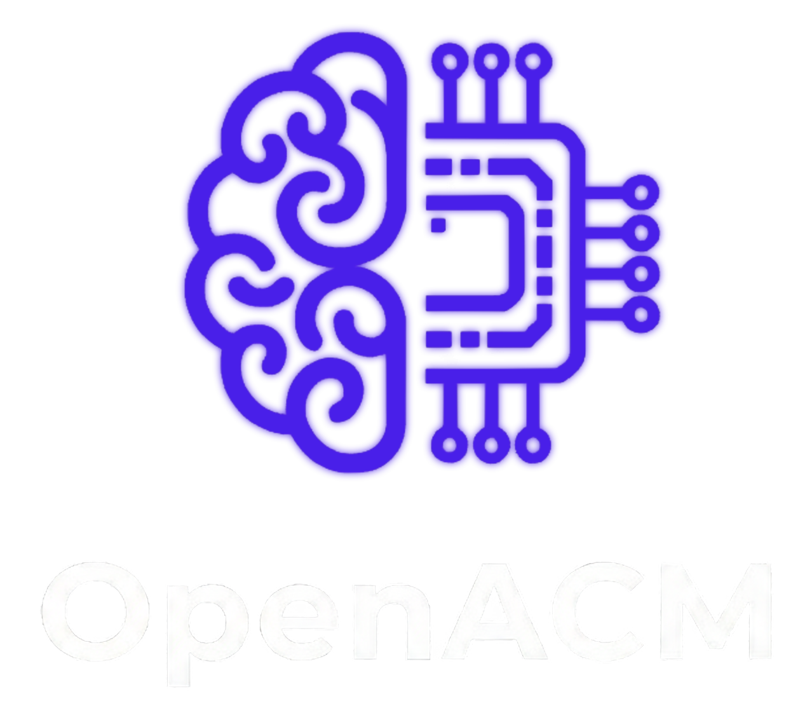

<p align="center">
  
</p>

# OpenACM — Open Autonomous Agent

<p align="center">
  
  
  
  
  
  
  
  
</p>

**OpenACM** is a self-hosted autonomous AI agent that runs on your PC or server. It controls your local environment, writes and executes code, navigates the web, runs specialized agents on Telegram/WhatsApp, and connects to any MCP server — all through a modern web dashboard.

No subscriptions. No cloud dependency. Your data stays local.

> Created and maintained by [Jeison Hernandez](https://github.com/Json55Hdz) / JsonProductions.  
> If you use or build on OpenACM, a credit or a star goes a long way.

---

## What it can do

- **Run commands & code** — executes shell commands (sandboxed, with confirmation modes) and stateful Python (Jupyter kernel)
- **Browse the web** — Playwright-powered browser automation: login, scrape, screenshot
- **Edit code surgically** — `edit_file`, `grep_in_files`, `get_file_outline`, `run_linter`
- **MCP Server support** — connect to any [Model Context Protocol](https://modelcontextprotocol.io) server (stdio, SSE or streamable HTTP)
- **Multi-channel** — chat via Web, Console, Telegram, Discord or WhatsApp (official Meta Cloud API), all sharing the same AI brain
- **Agents** — specialized assistants with their own prompt, tool allowlist, knowledge base, memory policy and their own Telegram / WhatsApp channels
- **Visual flows** — build agent automations in a node editor (HTTP, conditionals, loops, WooCommerce, variables) or let the AI build them from chat
- **Webhook connectors** — expose a flow as a public, signed webhook (`/api/webhooks/{slug}`) for payment providers, CRMs and form backends
- **Swarms** — multi-agent teams that plan and execute complex projects in parallel
- **Cron scheduler** — recurring jobs (skills, routines, shell commands, swarm templates)
- **Skills system** — Markdown-based behavior instructions injected when relevant
- **RAG memory** — ChromaDB long-term memory that persists across conversations, plus Code Resurrection (index your old projects)
- **Plugins** — built-in Gmail Classifier, Home Assistant and Content Automation plugins; write your own with a small Python API
- **Voice** — optional always-on voice daemon (faster-whisper STT + TTS) and in-browser TTS
- **Local intent router** — hybrid local/cloud architecture that skips the LLM for simple commands (~5ms, no tokens spent)
- **Loop trace debugger** — inspect every iteration: context size, tool calls, LLM timing, truncations

---

## Quick Start

### Option A — npm (recommended)

Requires Node.js 18+ and git.

```bash
npm i -g open-acm
openacm install   # clones the repo into ~/OpenACM and runs full setup
openacm start     # launch OpenACM
```

Or without installing globally:
```bash
npx open-acm install
npx open-acm start
```

**CLI commands:** `install` · `start` · `stop` · `status` · `update` · `repair` · `uninstall`  
Set `OPENACM_DIR=/custom/path` to install somewhere other than `~/OpenACM`.

---

### Option B — One-liner

**Linux / macOS:**
```bash
curl -fsSL https://raw.githubusercontent.com/Json55Hdz/OpenACM/main/install.sh | bash
```

**Windows (PowerShell as Administrator):**
```powershell
iwr -useb https://raw.githubusercontent.com/Json55Hdz/OpenACM/main/install.ps1 | iex
```

---

### Option C — Manual clone

#### Prerequisites

- **Python 3.12+** (the setup script installs it through `uv` if needed)
- **Node.js 20+** (needed to build the dashboard)
- **RAM**:
  - **Windows**: 8 GB minimum (Windows itself uses ~4 GB at idle + OpenACM ~1.8 GB).
  - **Linux / VPS**: 3 GB minimum, 4 GB or more recommended.
- **CPU**: 2 cores minimum, 3 or more recommended for high concurrency.
- An API key from any supported LLM provider (or a local Ollama / CLI provider)

#### Windows

```powershell
git clone https://github.com/Json55Hdz/OpenACM.git
cd OpenACM
.\setup.bat       # first time: installs everything and launches OpenACM
```

Next time just run:
```powershell
.\run.bat
```

#### Linux / macOS

```bash
git clone https://github.com/Json55Hdz/OpenACM.git
cd OpenACM
chmod +x setup.sh run.sh update.sh acm.sh
./setup.sh        # first time: installs everything and launches OpenACM
```

Next time just run:
```bash
./run.sh          # or: ./acm.sh start
```

To update later: `./update.sh` (or `update.bat` on Windows, or `openacm update`).

### Docker

The Compose file lives in `docker/` and publishes port **8080**. OpenACM listens on `127.0.0.1:47821` by default, so first tell it to listen on `0.0.0.0:8080` inside the container:

```bash
# config/local.yaml (mounted into the container)
cat > config/local.yaml <<'EOF'
web:
  host: 0.0.0.0
  port: 8080
EOF

docker compose -f docker/docker-compose.yml up -d --build
docker logs openacm   # your dashboard token is printed here
```

Open `http://localhost:8080`, paste the token, done. See [docs/32-docker.md](docs/32-docker.md) for details.

---

## First Launch

1. The console prints your **Dashboard Token** — copy it (it is also saved as `DASHBOARD_TOKEN` in `config/.env`)
2. Open `http://127.0.0.1:47821`
3. Paste the token to log in
4. The onboarding wizard helps you pick an LLM provider and add your API key (you can also use **Configuration** later, or the terminal wizard `openacm-setup`)

---

## Supported LLM Providers

Uses [LiteLLM](https://github.com/BerriAI/litellm) internally. Built-in provider presets:

| Provider | Provider id | Example model | API key env var |
|---|---|---|---|
| OpenCode Go (default) | `opencode_go` | `kimi-k2.5` | `OPENCODE_GO_API_KEY` |
| OpenAI | `openai` | `gpt-4o` | `OPENAI_API_KEY` |
| Anthropic | `anthropic` | `claude-sonnet-4-20250514` | `ANTHROPIC_API_KEY` |
| Google Gemini | `gemini` | `gemini-2.5-flash` | `GEMINI_API_KEY` |
| xAI (Grok) | `xai` | `grok-4.20-0309-non-reasoning` | `XAI_API_KEY` |
| OpenRouter | `openrouter` | `openrouter/auto` | `OPENROUTER_API_KEY` |
| Ollama (local) | `ollama` | `llama3.2` | — |
| CLI providers | `cli_claude`, `cli_gemini`, `cli_opencode` | uses your logged-in CLI | — |
| Any OpenAI-compatible API | custom | configure a base URL in **Configuration → Custom Providers** | stored with the provider |

---

## MCP Servers

Connect to any MCP server from the **MCP** dashboard page (or ask the agent to do it with `add_mcp_server`):

| Mode | When to use |
|---|---|
| Streamable HTTP (`streamable_http`) | unity-mcp, most modern servers — just paste the URL |
| SSE (`sse`, legacy) | older SSE-based MCP servers |
| Local stdio (`stdio`) | run a local process (`npx @modelcontextprotocol/server-filesystem`, etc.) |

Once connected, the AI automatically sees and uses those tools (named `mcp__{server}__{tool}`).

---

## Dashboard

| Page | What it does |
|---|---|
| Dashboard | Real-time stats, token usage, activity, live events |
| Chat | Multi-channel conversations with tool call visibility, uploads and a per-conversation terminal |
| Swarms | Create, plan and monitor multi-agent swarms |
| Daemon | Voice daemon control (STT/TTS) |
| Routines | Patterns detected from your OS activity |
| Cron | Scheduled jobs and run history |
| Tools | Browse available tools and execution history |
| Skills | Create and manage Markdown-based AI skills |
| Agents | Agents, their channels, knowledge, skills and visual flows |
| MCP | Connect to external tool servers |
| Connectors | Webhook connectors and their activity log |
| Traces | Per-request debugger: context size, tool timings, errors |
| Configuration | LLM model, API keys, channels, memory, security, integrations |
| Plugins | Enable/disable and configure plugins (Gmail Classifier, Home Assistant, Content) |

---

## Project Structure

```
OpenACM/
├── frontend/                   # Next.js dashboard (static export → src/openacm/web/static)
│   ├── app/                    # Page routes
│   ├── components/             # UI components (incl. flow-editor)
│   ├── hooks/                  # API and WebSocket hooks
│   └── stores/                 # Zustand state
├── src/openacm/
│   ├── app.py                  # Startup orchestrator
│   ├── core/                   # Brain, LLM router, memory, RAG, swarms, flows
│   ├── tools/                  # Built-in tools + MCP client + registry
│   ├── channels/               # Telegram, Discord, WhatsApp (+ per-agent channels)
│   ├── plugins/                # Built-in plugins (gmail_classifier, home_assistant, content)
│   ├── watchers/               # Activity watcher, cron scheduler, code resurrection
│   ├── voice/                  # Voice daemon + TTS providers
│   ├── cli/                    # openacm-setup / openacm-manage
│   └── web/                    # FastAPI server, routers, WebSockets
├── skills/                     # Built-in skill definitions
├── config/                     # default.yaml (committed) + local.yaml / .env (local, not committed)
├── docker/                     # Dockerfile + docker-compose.yml
├── docs/                       # Documentation
├── bin/openacm.js              # npm CLI (open-acm)
├── setup.* / run.* / update.* / acm.*   # Install / run / update scripts
└── install.sh / install.ps1    # Bootstrap installers
```

---

## Documentation

Full documentation lives in [`docs/`](docs/README.md) — getting started, architecture, tools, agents, flows, API reference, configuration, security, deployment and more.

---

## Privacy

OpenACM is fully self-hosted. The only outbound traffic is what you explicitly trigger:

- LLM API calls to the provider you configured
- Telegram/Discord/WhatsApp messages if you connect those channels
- Browser requests when you ask it to visit a site
- Integrations you configure (Google, Home Assistant, MCP servers, webhooks called from flows)

Everything else — conversations, API keys, files, memory — lives in `data/` and `config/` on your machine. Use Ollama for a fully offline setup.

---

## System Requirements

| | Minimum | Recommended |
|---|---|---|
| OS | Windows 10 / Ubuntu 22.04 / macOS 12 | Windows 11 / Ubuntu 24.04 |
| RAM | 8 GB (Windows) / 3 GB (Linux server) | 16 GB desktop / 4 GB+ server |
| CPU | 2 cores | 3+ cores |
| Storage | 5 GB | 20 GB |
| Python | 3.12+ | 3.12+ |
| Node.js | 20+ | 20+ |

---

## Contributing

Contributions are welcome. See [docs/CONTRIBUTING.md](docs/CONTRIBUTING.md).

---

## License

[MIT](LICENSE) — free to use, modify, and distribute.  
Copyright (c) 2026 Jeison David Hernandez Pena (JsonProductions). All copies and derivatives must include the original copyright notice.
