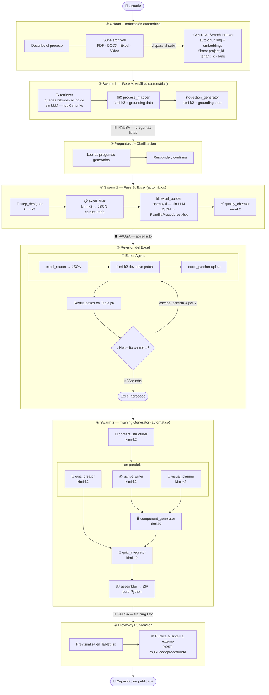
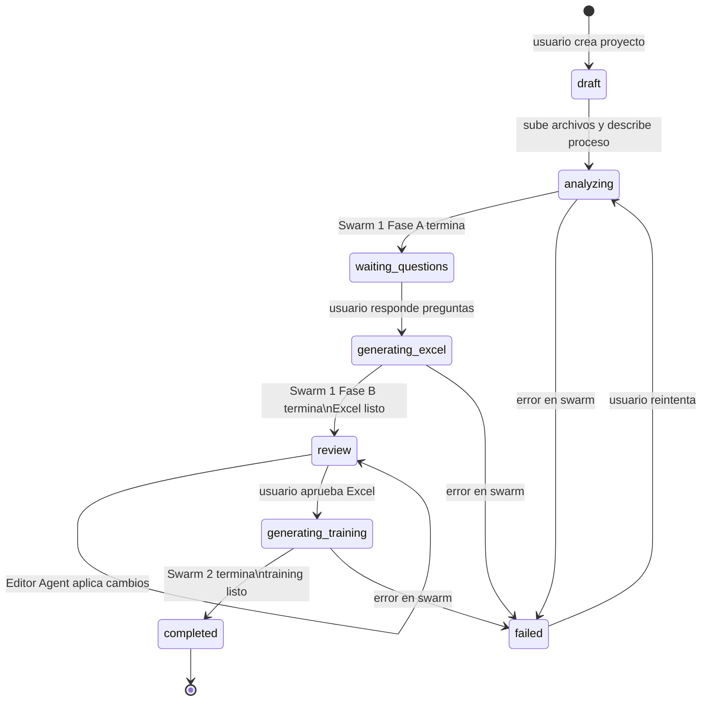
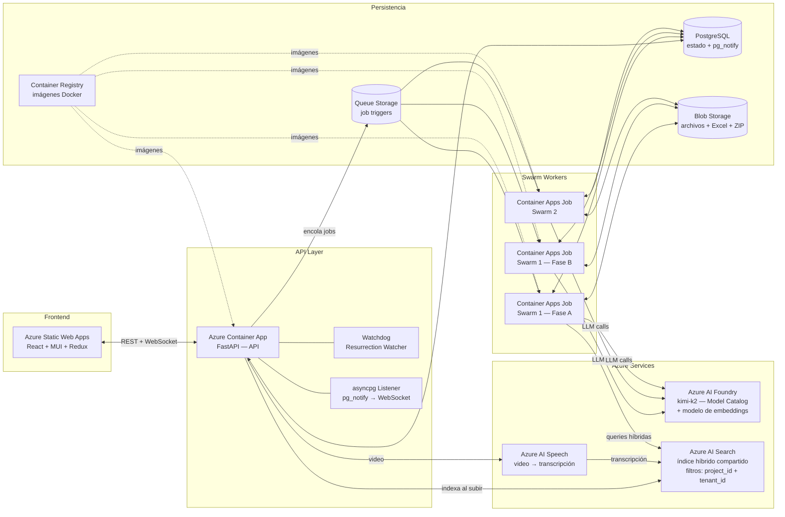
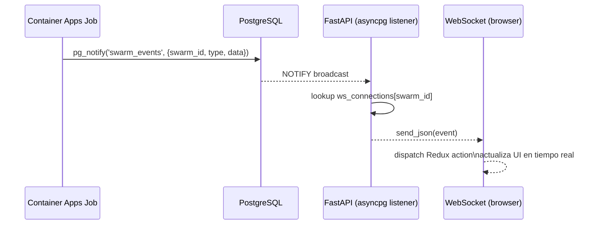
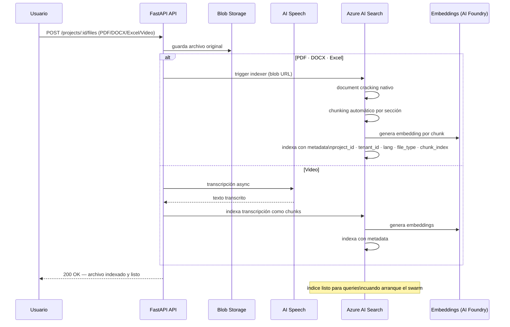
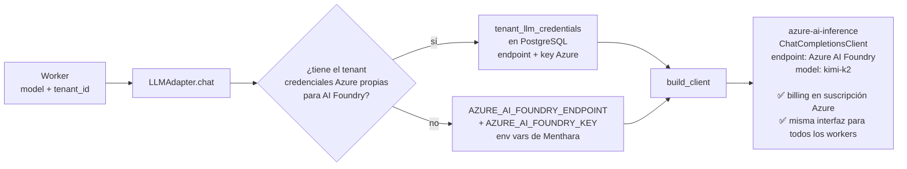
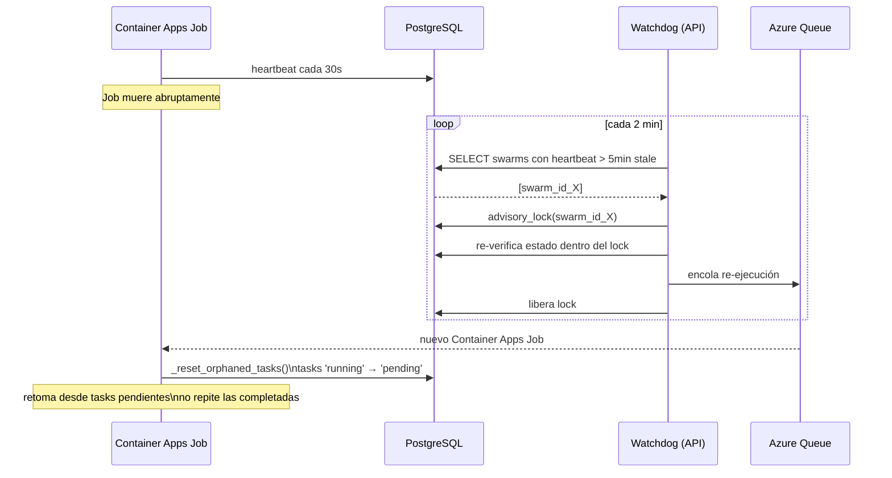

# Menthara — Diagrama de Arquitectura Completo

> Generado: 2026-05-05 | Basado en MENTHARA_PLAN.md v1

---

## 1. Flujo Principal — Journey del Usuario

---

## 2. Estado del Proyecto (State Machine)

---

## 3. Infraestructura Azure

---

## 4. Real-time (PG NOTIFY → WebSocket)

---

## 5. Swarm 1 — Detalle de Workers

```mermaid
gantt
    title Swarm 1 — Ejecución en el tiempo
    dateFormat X
    axisFormat %s

    section Pre-swarm (al subir archivos)
    AI Search indexer — auto chunking + embeddings   :done, pre1, 0, 15

    section Fase A (swarm arranca)
    retriever — queries híbridas al índice (sin LLM) :a1, after pre1, 5
    process_mapper — kimi-k2 + grounding data        :a2, after a1, 15
    question_generator — kimi-k2 + grounding data    :a3, after a2, 10

    section Pausa — usuario responde
    waiting_questions                                :crit, a4, after a3, 60

    section Fase B
    step_designer                                    :b1, after a4, 20
    excel_filler — JSON estructurado                 :b2, after b1, 15
    excel_builder — openpyxl sin LLM                 :b3, after b2, 5
    quality_checker                                  :b4, after b3, 10
```

---

## 6. Swarm 2 — Detalle de Workers

```mermaid
gantt
    title Swarm 2 — Ejecución en el tiempo
    dateFormat X
    axisFormat %s

    section Estructuración
    content_structurer    :s1, 0, 15

    section Generación paralela
    script_writer         :s2, after s1, 25
    quiz_creator          :s3, after s1, 20
    visual_planner        :s4, after s1, 20

    section Componentes
    component_generator   :s5, after s2, 30

    section Integración
    quiz_integrator       :s6, after s3, 15

    section Ensamblado
    assembler             :s7, after s5, 10
```

---

## 7. Pipeline de Indexación (Azure AI Search)

> Ocurre al momento de subir archivos — **antes** de que arranque el swarm. Índice compartido con filtros `project_id` + `tenant_id` para aislamiento multi-tenant.

---

## 8. LLM Adapter — Resolución de credenciales

> Kimi K2 se consume desde **Azure AI Foundry** (Model Catalog). El SDK es `azure-ai-inference` con `ChatCompletionsClient` — misma interfaz para todos los workers, credenciales y billing centralizados en Azure.

---

## 8. Idempotencia y Recuperación (Watchdog)

