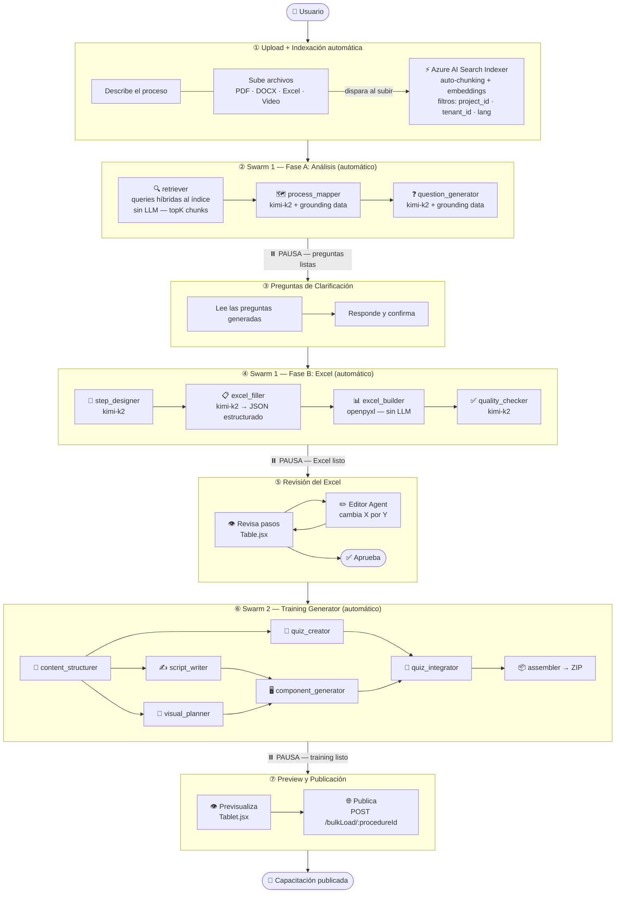

# Menthara — Flujo del Usuario

```mermaid
---
id: 6e2dbb0f-6048-4c36-8c98-cec791b8da63
---
flowchart TD
    START([👤 Usuario]) --> UV

    subgraph UV ["① Upload + Indexación automática"]
        UV1[Describe el proceso]
        UV2[Sube archivos\nPDF · DOCX · Excel · Video]
        UV3["⚡ Azure AI Search Indexer\nauto-chunking + embeddings\nfiltros: project_id · tenant_id · lang"]
        UV1 --- UV2
        UV2 -->|"dispara al subir"| UV3
    end

    UV --> S1A

    subgraph S1A ["② Swarm 1 — Fase A: Análisis (automático)"]
        direction LR
        RTV["🔍 retriever\nqueries híbridas al índice\nsin LLM — topK chunks"]
        PM["🗺️ process_mapper\nkimi-k2 + grounding data"]
        QG["❓ question_generator\nkimi-k2 + grounding data"]
        RTV --> PM --> QG
    end

    S1A -->|"⏸️ PAUSA — preguntas listas"| QV

    subgraph QV ["③ Preguntas de Clarificación"]
        QV1[Lee las preguntas generadas]
        QV2[Responde y confirma]
        QV1 --> QV2
    end

    QV --> S1B

    subgraph S1B ["④ Swarm 1 — Fase B: Excel (automático)"]
        direction LR
        SD["🎨 step_designer\nkimi-k2"]
        EF["📋 excel_filler\nkimi-k2 → JSON estructurado"]
        EB["📊 excel_builder\nopenpyxl — sin LLM"]
        QC["✅ quality_checker\nkimi-k2"]
        SD --> EF --> EB --> QC
    end

    S1B -->|"⏸️ PAUSA — Excel listo"| RV

    subgraph RV ["⑤ Revisión del Excel"]
        direction LR
        RV1["👁️ Revisa pasos\nTable.jsx"]
        RV2["✏️ Editor Agent\ncambia X por Y"]
        RV3(["✅ Aprueba"])
        RV1 --> RV2 --> RV1
        RV1 --> RV3
    end

    RV --> S2

    subgraph S2 ["⑥ Swarm 2 — Training Generator (automático)"]
        direction LR
        CS["📐 content_structurer"]
        SW["✍️ script_writer"]
        QC2["🧪 quiz_creator"]
        VP["🎨 visual_planner"]
        CG["🖥️ component_generator"]
        QI["🔗 quiz_integrator"]
        ASM["📦 assembler → ZIP"]
        CS --> SW & QC2 & VP
        SW --> CG
        VP --> CG
        QC2 --> QI
        CG --> QI
        QI --> ASM
    end

    S2 -->|"⏸️ PAUSA — training listo"| TV

    subgraph TV ["⑦ Preview y Publicación"]
        TV1["👁️ Previsualiza\nTablet.jsx"]
        TV2["🌐 Publica\nPOST /bulkLoad/:procedureId"]
        TV1 --> TV2
    end

    TV --> DONE(["🎉 Capacitación publicada"])
```
